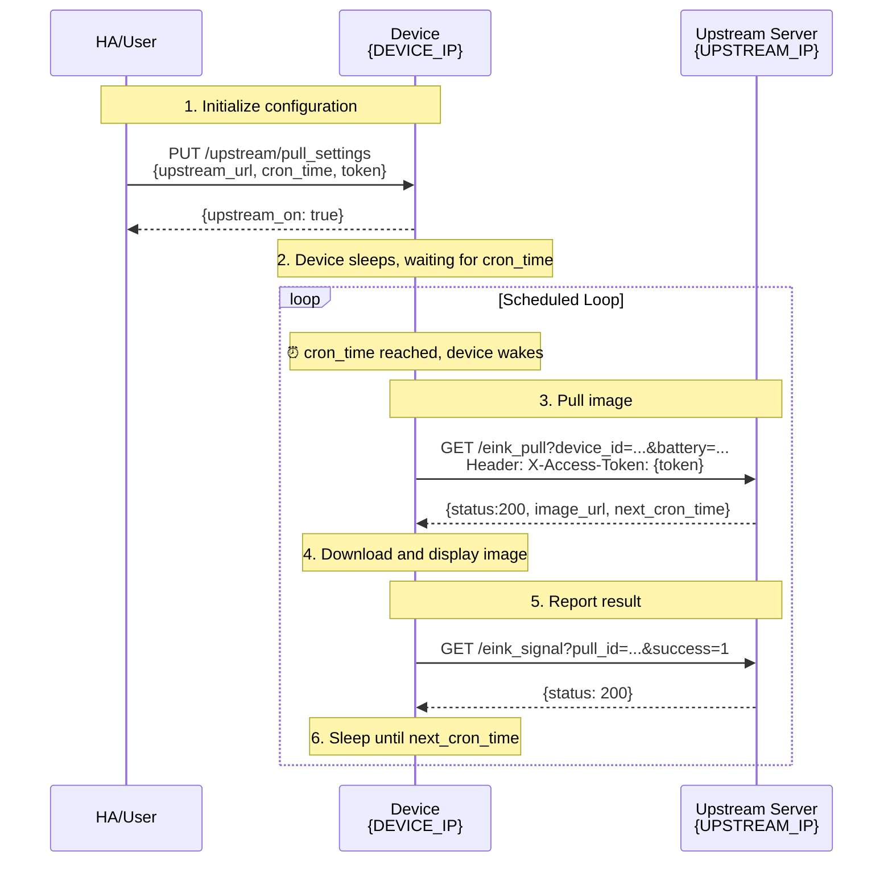

# Schedule Pull API -- BLOOMIN8 CANVAS

**Last Updated**: 2025-12-22

> **Core Concept**: Configure device's upstream server and wake time via `PUT /upstream/pull_settings`. Device wakes at scheduled time, calls your `/eink_pull` to get image URL, displays it, then schedules next wake based on `next_cron_time` in response - forming a loop.

This document describes how to implement scheduled image pulling via the device's `/upstream/pull_settings` endpoint, allowing Home Assistant users to build their own server to control device image scheduling.

---

## 1. Device Endpoint: `/upstream/pull_settings`

### 1.1 Get Current Configuration

```http
GET http://{device_ip}/upstream/pull_settings
```

**Response Example:**
```json
{
  "upstream_on": true,
  "upstream_url": "https://your-upstream.com",
  "token": "eyJhbGci...",
  "next_cron_time": 1766400360,
  "pre_image": "",
  "time": 1766400249
}
```

| Field | Type | Description |
|-------|------|-------------|
| `upstream_on` | Boolean | Whether scheduled pulling is enabled |
| `upstream_url` | String | Upstream server address |
| `token` | String | Access token |
| `next_cron_time` | Integer | Next wake time (Unix timestamp in seconds, 0 = not set) |
| `pre_image` | String | Last displayed image URL |
| `time` | Integer | Device current time (Unix timestamp in seconds) |

### 1.2 Update Configuration

```http
PUT http://{device_ip}/upstream/pull_settings
Content-Type: application/json

{
    "upstream_on": true,
    "upstream_url": "https://your-upstream.com",
    "token": "your-custom-token",
    "cron_time": "2025-11-01T08:30:00Z"
}
```

### 1.3 Parameters

| Parameter | Type | Required | Description |
|-----------|------|----------|-------------|
| `upstream_on` | Boolean | No | Enable/disable scheduled pulling. `false` stops scheduling |
| `upstream_url` | String | No | Upstream server address (device will call `{upstream_url}/eink_pull`) |
| `token` | String | No | Custom token, device includes in Header when calling upstream |
| `cron_time` | String | No | Next pull time, **must be UTC ISO 8601 format**, e.g. `2025-11-01T08:30:00Z` |

> **Note**: PUT uses ISO 8601 format for `cron_time` (e.g. `2025-11-01T08:30:00Z`), but GET returns `next_cron_time` as Unix timestamp (seconds).

**Response:** Returns updated fields
```json
{
  "upstream_on": true
}
```

---

## 2. Upstream Endpoints: APIs You Need to Implement

When device wakes at `cron_time`, it calls the following endpoints on your server:

### 2.1 `/eink_pull` - Device Pulls Image

**Device Request:**
```http
GET {upstream_url}/eink_pull?device_id={device_id}&pull_id={uuid}&cron_time={iso_time}&battery={percent}
X-Access-Token: {your-token}
```

**Query Parameters:**

| Parameter | Type | Description |
|-----------|------|-------------|
| `device_id` | String | Device unique identifier |
| `pull_id` | String | Unique ID for this pull request (UUID) |
| `cron_time` | String | Current scheduled time (ISO 8601 UTC) |
| `battery` | Integer | Device battery percentage |

**Your server should return:** Responses are always sent as `HTTP/1.1 200 OK` with `Content-Type: application/json`. The `status` field inside the JSON body carries the business outcome (200 / 204 / …), and `data.next_cron_time` must be present in every response so the device knows when to wake again.

#### Case 1: Image available

```http
HTTP/1.1 200 OK
Content-Type: application/json

{
  "status": 200,
  "type": "SHOW",
  "message": "Image retrieved successfully",
  "data": {
    "next_cron_time": "2025-11-01T09:00:00Z",
    "image_url": "https://your-upstream.com/images/photo_P.jpg"
  }
}
```

#### Case 2: No image available

```http
HTTP/1.1 200 OK
Content-Type: application/json

{
  "status": 204,
  "message": "No image available",
  "data": {
    "next_cron_time": "2025-11-01T09:00:00Z"
  }
}
```

#### Case 3: Stop scheduled pulling

```http
HTTP/1.1 200 OK
Content-Type: application/json

{
  "status": 200,
  "message": "Stopping scheduled pull",
  "data": {
    "next_cron_time": null
  }
}
```

**Key Fields:**

| Field | Description |
|-------|-------------|
| `status` | Business status carried in the body. `200` = image returned, `204` = no image this cycle. The HTTP status line is always `200 OK`. |
| `type` | `SHOW`=display image, `RECOVER`=restore default image |
| `next_cron_time` | Next pull time (UTC ISO 8601). Set to `null` or `1970-01-01T00:00:00Z` to stop scheduling |
| `image_url` | Image URL, filename must end with `_P.jpg` or `_L.jpg` to specify orientation |

### 2.2 `/eink_signal` - Device Feedback (Optional)

Device calls this endpoint after displaying image to report result:

**Device Request:**
```http
GET {upstream_url}/eink_signal?pull_id={uuid}&success={0|1}
X-Access-Token: {your-token}
```

**Query Parameters:**

| Parameter | Type | Description |
|-----------|------|-------------|
| `pull_id` | String | Corresponding pull_id from eink_pull |
| `success` | Integer | 0=failed, 1=success |

**Your server can return:**
```json
{
  "status": 200,
  "message": "Feedback recorded"
}
```

---

## 3. Workflow

```
DEVICE_IP   = Device IP (e.g. 192.168.1.100)
UPSTREAM_IP = Upstream server IP (e.g. 192.168.1.50:8080)
```



---

## 4. Examples

### Example 1: Pull image every 30 minutes

**Initialize configuration:**
```http
PUT http://192.168.1.100/upstream/pull_settings
Content-Type: application/json

{
    "upstream_on": true,
    "upstream_url": "http://192.168.1.50:8080",
    "token": "my-secret-token",
    "cron_time": "2025-11-01T08:00:00Z"
}
```

**Server `/eink_pull` response logic:**
```python
from datetime import datetime, timedelta

def eink_pull(request):
    # Get current UTC time
    now = datetime.utcnow()
    # Calculate time 30 minutes later
    next_time = now + timedelta(minutes=30)

    # Return image and next time
    return {
        "status": 200,
        "type": "SHOW",
        "message": "success",
        "data": {
            "next_cron_time": next_time.strftime("%Y-%m-%dT%H:%M:%SZ"),
            "image_url": "http://192.168.1.50:8080/images/current_P.jpg"
        }
    }
```

### Example 2: Display only when new image available

```python
image_queue = []  # Image queue

def eink_pull(request):
    now = datetime.utcnow()
    next_time = now + timedelta(minutes=10)  # Check again in 10 minutes

    if image_queue:
        image_url = image_queue.pop(0)
        return {
            "status": 200,
            "type": "SHOW",
            "data": {
                "next_cron_time": next_time.strftime("%Y-%m-%dT%H:%M:%SZ"),
                "image_url": image_url
            }
        }
    else:
        return {
            "status": 204,
            "message": "No new image",
            "data": {
                "next_cron_time": next_time.strftime("%Y-%m-%dT%H:%M:%SZ")
            }
        }
```

### Example 3: Dynamic scheduling with image queue

Use a time-keyed queue `{cron_time: ImageObject}` for precise scheduling:

```python
# Queue: key = scheduled time, value = image info
image_queue = {
    "2025-11-01T09:00:00Z": {"url": "http://server/morning_P.jpg"},
    "2025-11-01T18:00:00Z": {"url": "http://server/evening_P.jpg"},
}

def eink_pull(request):
    cron_time = request.args.get("cron_time")
    now = datetime.utcnow()

    # Check if image scheduled for this time
    if cron_time in image_queue:
        image = image_queue.pop(cron_time)
        # Find next scheduled time, or poll in 30min
        next_time = min(image_queue.keys()) if image_queue else None
        return {
            "status": 200,
            "type": "SHOW",
            "data": {
                "next_cron_time": next_time or (now + timedelta(minutes=30)).strftime("%Y-%m-%dT%H:%M:%SZ"),
                "image_url": image["url"]
            }
        }
    else:
        # No image - poll again in 10min until queue has entry
        next_time = min(image_queue.keys()) if image_queue else (now + timedelta(minutes=10)).strftime("%Y-%m-%dT%H:%M:%SZ")
        return {
            "status": 204,
            "data": {"next_cron_time": next_time}
        }
```

**Key points:**
- `status: 204` + fixed interval = polling mode (no image yet)
- `status: 200` + exact time = precise scheduling (image ready at specific time)
- Queue with `cron_time` as key enables time-sensitive image delivery

### Example 4: Stop scheduled pulling

**Method 1: Via device endpoint**
```http
PUT http://192.168.1.100/upstream/pull_settings
Content-Type: application/json

{
    "upstream_on": false
}
```

**Method 2: Via server response**

Regardless of whether an image is returned (status 200 or 204), setting `next_cron_time` to `null` or `1970-01-01T00:00:00Z` tells device to stop scheduling - there will be no next pull.

```json
{
  "status": 200,
  "data": {
    "next_cron_time": null
  }
}
```

or

```json
{
  "status": 204,
  "data": {
    "next_cron_time": "1970-01-01T00:00:00Z"
  }
}
```

---

## 5. Important Notes

### 5.1 Timing

1. **Timezone**: `cron_time` and `next_cron_time` must use **UTC timezone** (ending with `Z`)
   - Correct: `2025-11-01T08:30:00Z`
   - Wrong: `2025-11-01T16:30:00+08:00`

2. **Time Validity**: `next_cron_time` must be a **future** time. If you return a past time the device will pull again on its very next wake (busy loop).

3. **Minimum interval**: Avoid intervals shorter than 1 minute. Device wake + render + display takes ~10–30 s; tighter scheduling will overrun.

### 5.2 Authentication

- Recommended to validate `X-Access-Token` header on server side to ensure requests come from your device.
- The token is whatever you supplied via `PUT /upstream/pull_settings`; rotate it by PUT-ing a new value.

### 5.3 Image Requirements (this is where most issues come from)

- **Format**: JPEG only (`.jpg`).
- **Encoding**: **Baseline JPEG**. Progressive JPEG is **not** supported by the firmware decoder.
  - Verify: `file your.jpg` → should report `JPEG image data, baseline, precision 8, …`
  - Convert progressive → baseline:
    ```bash
    convert input.jpg -interlace none output.jpg
    # or
    jpegtran -copy none input.jpg > output.jpg
    ```
- **Color**: 8-bit, 3-channel (RGB). Avoid CMYK / grayscale unless you've tested it on your device.
- **Resolution**: Match device screen (e.g. 480×800 for a small Canvas, 1200×1600 for a large one). Larger images waste bandwidth and may exceed device memory.
- **Orientation Rules**:
  - Image must be stored in **portrait** pixel orientation (taller than wide).
  - If original content is landscape, **rotate 90° clockwise** before saving.
  - Filename suffix specifies display orientation:
    - `_P.jpg` = Portrait display
    - `_L.jpg` = Landscape display (device rotates the stored portrait pixels 90° counter-clockwise at display time)
  - Examples: `sunset_L.jpg` (landscape display), `portrait_P.jpg` (portrait display).

### 5.4 Static-File HTTP Server Requirements

The device's HTTP client is intentionally simple. Your `image_url` host **must** return responses that satisfy all of the following:

| Requirement | Why | How to verify |
|---|---|---|
| `Content-Length: <number>` present and correct | Firmware reads this to size its buffer. Missing → log shows `File size: -1` and the device hangs. | `curl -I <url>` shows numeric `Content-Length` |
| **No** `Transfer-Encoding: chunked` | Firmware does not handle chunked transfer. Some reverse proxies turn this on automatically when streaming files. | Headers must not contain `Transfer-Encoding` |
| **No** `Content-Encoding: gzip` / `br` | Firmware does not decompress. | Headers must not contain `Content-Encoding` |
| `Content-Type: image/jpeg` | Must be exactly this. Not `image/jpg`, not `application/octet-stream`. | `curl -I <url>` shows `Content-Type: image/jpeg` |
| Direct 200 response, **no** 30x redirect | Firmware does not follow `Location:`. | `curl -I <url>` returns `HTTP/1.1 200` (not 301/302/307/308) |
| HTTPS with full, public-CA chain | Embedded TLS stacks are picky. Self-signed or partial chains may silently fail. | `curl --tls-max 1.2 -v <url>` succeeds without `-k` |

If `image_url` is HTTPS and the device hangs while plain `http://` works, it's a TLS issue.

**Reference response** (what our cloud serves; use this as the baseline to compare against):

```
HTTP/2 200
content-type: image/jpeg
content-length: 49427
accept-ranges: bytes
```

### 5.5 Device HTTP Client Behavior

- Sends `GET` with `X-Access-Token: <your-token>` header to `eink_pull` and `eink_signal`.
- Reads response body up to `Content-Length` bytes; aborts after a timeout (~60 s end-to-end).
- Does **not** follow redirects.
- Does **not** decompress `Content-Encoding`.
- Does **not** support HTTP/2 server push or partial / `Range` requests on the upstream control endpoints (the image fetch supports range but the device does not currently use it).

### 5.6 `eink_signal` Triggering

The device only calls `eink_signal` **after the image is successfully decoded and displayed**. If the download stalls (e.g. `File size: -1`) or the JPEG is rejected, you will **never** see an `eink_signal` request — that's a symptom, not an independent endpoint to test.

### 5.7 Recovery After Stop

Once the device stops scheduled pulling (received `next_cron_time = null` or the user toggled `upstream_on = false`), it will not pull again on its own. You need to:
1. Wake the device (BLE / press button / arrival of an explicit push), AND
2. `PUT /upstream/pull_settings` with `upstream_on: true` and a new future `cron_time`.

---

## 6. Troubleshooting

### 6.1 Symptom-driven checklist

| Symptom | Probable cause | Fix |
|---|---|---|
| Device log shows `File size: -1` then `Pull task timed out` | Static-file server missing `Content-Length` or using chunked / gzip | See §5.4. Run `curl -I <image_url>` and compare against reference response. |
| Device downloads but never displays, no `eink_signal` ever arrives | Image decode failed (most often: progressive JPEG, or wrong color profile) | Check with `file <jpg>` — must be **baseline**. Re-encode if needed (§5.3). |
| Device pulls every minute regardless of `next_cron_time` | `next_cron_time` returned is in the past, or in non-UTC timezone | Always emit UTC ISO 8601 with trailing `Z`, in the future relative to *device clock*. |
| Device never wakes after first pull | `next_cron_time` was `null` or `1970-01-01T00:00:00Z` (intentionally stops scheduling) | Send a fresh `PUT /upstream/pull_settings` to re-arm. |
| Device wakes once on the empty-gallery path and then never wakes again | Server replied with HTTP status `204 No Content`. Per RFC 9110 a 204 response carries no body, so the JSON (including `next_cron_time`) is dropped before it reaches the device. | Reply with `HTTP/1.1 200 OK` and put `"status": 204` inside the JSON body (see §2.1 Case 2). |
| Pull works on Wi-Fi, fails on cellular / through reverse proxy | Proxy rewrote response (added `Transfer-Encoding: chunked`, dropped `Content-Length`, or wrapped in 30x) | Configure the proxy/CDN to pass through `Content-Length` and not buffer-stream. Cloudflare: turn off "Auto Minify" + "Brotli" for the image path. |
| HTTPS pull fails, HTTP same URL works | TLS chain incomplete or unsupported cipher | Use a public-CA cert (Let's Encrypt is fine). Verify with `openssl s_client -connect host:443 -servername host </dev/null \| head`. |
| `Pull response image_url:` line missing in log | Your `/eink_pull` response is malformed / wrong content-type | Return JSON with `Content-Type: application/json` and a top-level `status` + `data.image_url` field. |

### 6.2 Verifying your server end-to-end

Run these commands on your dev machine (not the device) and compare with the reference output below:

```bash
# 1. Headers of your image
curl -I "https://your-server/path/photo_P.jpg"

# 2. Full response of your /eink_pull
curl -v "https://your-server/eink_pull?device_id=TEST&pull_id=$(uuidgen)&cron_time=2025-12-22T10:00:00Z&battery=80" \
     -H "X-Access-Token: your-token"

# 3. Verify the JPEG is baseline
curl -s -o /tmp/test.jpg "<image_url from step 2>"
file /tmp/test.jpg
# expected: JPEG image data, baseline, precision 8, 1200x1600, components 3
```

If all three look right and the device still misbehaves, capture a fresh device log over 1–2 pull cycles and share both the log and the three `curl` outputs above.

### 6.3 Known firmware quirks

- The log line `Network status: 0, download succeeded:` after `File size: -1` is misleading — the firmware reports "succeeded" when the socket closes cleanly even though no usable body was read. Treat `File size: -1` as authoritative.
- `Free heap` < 40 KB before download can cause OOM during JPEG decode. Reduce image dimensions or quality if your hardware is memory-constrained.

---
